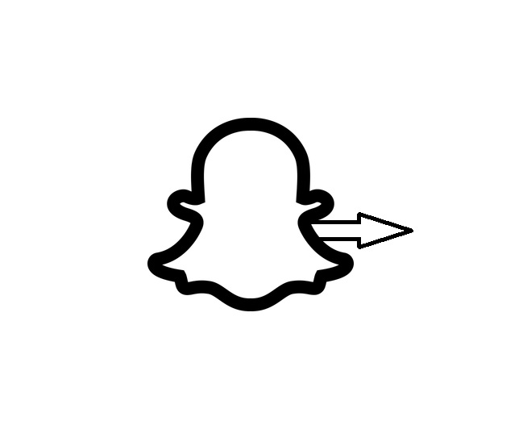
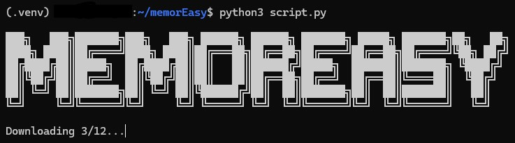
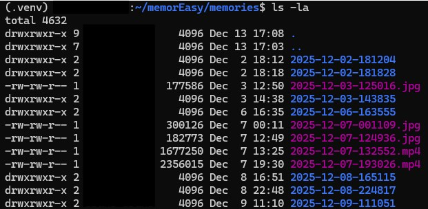

<!-- Improved compatibility of back to top link: See: https://github.com/othneildrew/Best-README-Template/pull/73 -->
<a id="readme-top"></a>
<!--
*** Thanks for checking out the Best-README-Template. If you have a suggestion
*** that would make this better, please fork the repo and create a pull request
*** or simply open an issue with the tag "enhancement".
*** Don't forget to give the project a star!
*** Thanks again! Now go create something AMAZING! :D
-->


<!-- PROJECT SHIELDS -->
<!--
*** I'm using markdown "reference style" links for readability.
*** Reference links are enclosed in brackets [ ] instead of parentheses ( ).
*** See the bottom of this document for the declaration of the reference variables
*** for contributors-url, forks-url, etc. This is an optional, concise syntax you may use.
*** https://www.markdownguide.org/basic-syntax/#reference-style-links
-->
<div align="center">
  
[![Contributors][contributors-shield]][contributors-url]
[![Forks][forks-shield]][forks-url]
[![Stargazers][stars-shield]][stars-url]
[![Issues][issues-shield]][issues-url]
[![project_license][license-shield]][license-url]

</div>


<!-- PROJECT LOGO -->
<br />
<div align="center">
  <a href="https://github.com/bransoned/MemorEasy">
    
  </a>

<h3 align="center">MemorEasy</h3>

  <p align="center">
    Python tool used to downlad, extract, and apply date, time, and location data to Snapchat Memories EXIF data. 
    <br />
<!--    <a href="https://github.com/bransoned/MemorEasy"><strong>Explore the docs »</strong></a> -->
    <br />
    <br />
<!--    <a href="https://github.com/bransoned/MemorEasy">View Demo</a>
    &middot; -->
    <a href="https://github.com/bransoned/MemorEasy/issues/new?labels=bug&template=bug-report---.md">Report Bug</a>
    &middot;
    <a href="https://github.com/bransoned/MemorEasy/issues/new?labels=enhancement&template=feature-request---.md">Request Feature</a>
  </p>
</div>


<!-- TABLE OF CONTENTS -->
<details>
  <summary>Table of Contents</summary>
  <ol>
    <li>
      <a href="#about-the-project">About The Project</a>
<!--      <ul>
        <li><a href="#built-with">Built With</a></li>
      </ul> -->
    </li>
    <li>
      <a href="#getting-started">Getting Started</a>
      <ul>
        <li><a href="#prerequisites">Prerequisites</a></li>
        <li><a href="#installation">Installation</a></li>
      </ul>
    </li>
    <li><a href="#usage">Usage</a></li>
    <li><a href="#roadmap">Roadmap</a></li>
    <li><a href="#contributing">Contributing</a></li>
    <li><a href="#license">License</a></li>
    <li><a href="#contact">Contact</a></li>
    <li><a href="#acknowledgments">Acknowledgments</a></li>
  </ol>
</details>


<!-- ABOUT THE PROJECT -->
## About The Project

<!--[![Product Name Screen Shot][product-screenshot]](https://example.com)-->

This project is intended to provide a simplified and better-implemented approach for exporting Snapchat memories compared to the system provided by Snapchat and their Javascript implementation.

When using MemorEasy, you can rapidly download your Memories from Snapchat's cloud to your computer, while also tagging them with their relevant metadata in the EXIF section. Snapchat does not provide imbedded metadata
in the images from their servers, which is what makes importing with MemorEasy so important.

Likewise, the script also saves filenames in an organized format of `YYYY-MM-DD-HHMMSS.ext` inside of a child directory named `./memories/` in the parent directory where the script is executed. No more dealing with
the naming conventions Snapchat employs with randomized SID values.

Lastly, the script combines PNG layers back with their parent JPG/MP4 files to reflect how your Memories look inside of Snapchat itself. MemorEasy also saves a master JPG/MP4 file with no layers to preserve the original photo.
<p align="right">(<a href="#readme-top">back to top</a>)</p>


<!--
### Built With
TODO Add built with images
* [![Next][Next.js]][Next-url]
* [![React][React.js]][React-url]
* [![Vue][Vue.js]][Vue-url]
* [![Angular][Angular.io]][Angular-url]
* [![Svelte][Svelte.dev]][Svelte-url]
* [![Laravel][Laravel.com]][Laravel-url]
* [![Bootstrap][Bootstrap.com]][Bootstrap-url]
* [![JQuery][JQuery.com]][JQuery-url]

<p align="right">(<a href="#readme-top">back to top</a>)</p>
-->


<!-- GETTING STARTED -->
## Getting Started


### Prerequisites

<!--This is an example of how to list things you need to use the software and how to install them.
* npm
  ```sh
  npm install npm@latest -g
  ```
-->

1. [Download your Memories data from Snapchat.](https://help.snapchat.com/hc/en-us/articles/7012305371156-How-do-I-download-my-data-from-Snapchat)
    - When asked which data you would like, only selecting the "Memories" option is required for this project, but you may select more data if you wish.
      **NOTE:** This will not export your My Eyes Only folder. This must be done manually in the app.
    - Ensure that the date range you want selected is correct. We recommend toggling date selection off to query all Memories on your account if this is
      your first time exporting Memories and/or running this script.
    - Lastly, when delivered the zip file from Snapchat with your data, unzip and find the `memories_history.html` file. MemorEasy will parse this file
      for all of the information needed to import your Memories.
    - TODO Add images or a GIF showing process of selecting data.
<!--2. Confirm that [Python](https://www.python.org/downloads/) is installed on your system.-->

### Quick Start (Recommended)
... Especially for Windows users

1. Download the pre-built executable for your platform from the latest release
   - [Windows](https://github.com/bransoned/MemorEasy/releases/download/v1.0.0/MemorEasy.exe)
   - [Linux](https://github.com/bransoned/MemorEasy/releases/download/v1.0.0/MemorEasy-Linux) (built on ubuntu-latest)
   - [macOS](https://github.com/bransoned/MemorEasy/releases/download/v1.0.0/MemorEasy-macOS) (untested)
2. Move the downloaded executable/binary to the folder or directory where you want the images to be downloaded
   - Windows Example: Move `MemorEasy.exe` to `C:\Users\username\Pictures\`
   - Linux/macOS Example: Move `MemorEasy-Linux` or `MemorEasy-macOS` to `~/Pictures/`
3. Place the `memories_history.html` file in the same folder or directory as the executable/binary file

### Installation from Source (Advanced)

1. Clone and enter the repo where you would like the Memories to be imported
   ```sh
   git clone https://github.com/bransoned/MemorEasy.git
   cd MemorEasy
   ```
2. Create and source a virtual environment (skip this step if you already have a virtual environment you would like to use)
    ```sh
    python3 -m venv .venv
    source .venv/bin/activate
    ```
3. Install the required libraries
    ```sh
    pip3 install -r requirements.txt
    ```
4. Install the required dependencies
   - Windows: Download [exiftool](https://exiftool.org/exiftool-13.43_64.zip)
     and [ffmpeg](https://github.com/BtbN/FFmpeg-Builds/releases/download/latest/ffmpeg-master-latest-win64-gpl.zip)
     executables and add them to your PATH to be found by the OS/Python 
   - Linux:
     ```sh
     sudo apt-get update
     sudo apt-get install -y ffmpeg exiftool
     ```
   - macOS:
     ```sh
     brew install ffmpeg exiftool
     ```
5. Copy your `memories_history.html` file into the top level of the project directory
<p align="right">(<a href="#readme-top">back to top</a>)</p>

### Running MemorEasy

1. For Quickstart:
    - Run the script by double clicking the file if in a graphical interface or if in terminal by running `./MemorEasy.exe` or `./MemorEasy-OS_Name`
    - A shell or terminal window should appear and show current progress of downloads
    - MemorEasy will generate a `memories/` folder that will contain all of the organized JPGs, MP4s, and folders with your images
  

2. For Installation from Source:
    - Once the required libraries, dependencies, and user-specific `memories_history.html` file are installed and copied into the directory, you can run the script
      ```sh
      python3 script.py
      ```
    - The script should output the progress of the downloads and will generate a `./memories/` directory that will contain all of the organized JPGs, MP4s, and folders with your images
3. **NOTE:** If exporting many memories, this may take some time. Go get a coffee :\)

<!-- USAGE EXAMPLES -->
## Usage
Running the script:



Results after script is finished:



<p align="right">(<a href="#readme-top">back to top</a>)</p>


<!-- ROADMAP -->
## Roadmap

- [ ] Implement SQLite DB to track files that have been downloaded for fault-protection
- [ ] Write unit tests
- [ ] Implement better error handling and exception raising
- [ ] General refactoring of code, bug fixes when found

See the [open issues](https://github.com/bransoned/MemorEasy/issues) for a full list of proposed features (and known issues).

<p align="right">(<a href="#readme-top">back to top</a>)</p>


<!-- CONTRIBUTING -->
## Contributing

Contributions are what make the open source community such an amazing place to learn, inspire, and create. Any contributions you make are **greatly appreciated**.

If you have a suggestion that would make this better, please fork the repo and create a pull request. You can also simply open an issue with the tag "enhancement".
Don't forget to give the project a star! Thanks again!

1. Fork the Project
2. Create your Feature Branch (`git checkout -b feature/AmazingFeature`)
3. Commit your Changes (`git commit -m 'Add some AmazingFeature'`)
4. Push to the Branch (`git push origin feature/AmazingFeature`)
5. Open a Pull Request

If you do not feel comfortable contributing code to the project, you can also leave feedback in the Issues or Discussion sections.

<p align="right">(<a href="#readme-top">back to top</a>)</p>

### Top contributors:

<a href="https://github.com/bransoned/MemorEasy/graphs/contributors">
  
</a>


<!-- LICENSE -->
## License

Distributed under the AGPL-3.0 license. See `license.txt` for more information.

<p align="right">(<a href="#readme-top">back to top</a>)</p>


<!-- CONTACT -->
## Contact

bransoned - [Discord](https://discord.com/users/b.ranson)

Project Link: [https://github.com/bransoned/MemorEasy](https://github.com/bransoned/MemorEasy)

<p align="right">(<a href="#readme-top">back to top</a>)</p>


<!-- ACKNOWLEDGMENTS -->
## Acknowledgments

* This is a personal project intended for my use-cases. I feel that others may be able to benefit from this tool, so I would like to share it, along with the development process, with others.

<p align="right">(<a href="#readme-top">back to top</a>)</p>


<!-- MARKDOWN LINKS & IMAGES -->
<!-- https://www.markdownguide.org/basic-syntax/#reference-style-links -->
[contributors-shield]: https://img.shields.io/github/contributors/bransoned/MemorEasy.svg?style=for-the-badge
[contributors-url]: https://github.com/bransoned/MemorEasy/graphs/contributors
[forks-shield]: https://img.shields.io/github/forks/bransoned/MemorEasy.svg?style=for-the-badge
[forks-url]: https://github.com/bransoned/MemorEasy/network/members
[stars-shield]: https://img.shields.io/github/stars/bransoned/MemorEasy.svg?style=for-the-badge
[stars-url]: https://github.com/bransoned/MemorEasy/stargazers
[issues-shield]: https://img.shields.io/github/issues/bransoned/MemorEasy.svg?style=for-the-badge
[issues-url]: https://github.com/bransoned/MemorEasy/issues
[license-shield]: https://img.shields.io/github/license/bransoned/MemorEasy.svg?style=for-the-badge
[license-url]: https://github.com/bransoned/MemorEasy/blob/master/license.txt
[linkedin-shield]: https://img.shields.io/badge/-LinkedIn-black.svg?style=for-the-badge&logo=linkedin&colorB=555
[product-screenshot]: images/screenshot.png


<!-- Shields.io badges. You can a comprehensive list with many more badges at: https://github.com/inttter/md-badges -->
<!--
[Next.js]: https://img.shields.io/badge/next.js-000000?style=for-the-badge&logo=nextdotjs&logoColor=white
[Next-url]: https://nextjs.org/
[React.js]: https://img.shields.io/badge/React-20232A?style=for-the-badge&logo=react&logoColor=61DAFB
[React-url]: https://reactjs.org/
[Vue.js]: https://img.shields.io/badge/Vue.js-35495E?style=for-the-badge&logo=vuedotjs&logoColor=4FC08D
[Vue-url]: https://vuejs.org/
[Angular.io]: https://img.shields.io/badge/Angular-DD0031?style=for-the-badge&logo=angular&logoColor=white
[Angular-url]: https://angular.io/
[Svelte.dev]: https://img.shields.io/badge/Svelte-4A4A55?style=for-the-badge&logo=svelte&logoColor=FF3E00
[Svelte-url]: https://svelte.dev/
[Laravel.com]: https://img.shields.io/badge/Laravel-FF2D20?style=for-the-badge&logo=laravel&logoColor=white
[Laravel-url]: https://laravel.com
[Bootstrap.com]: https://img.shields.io/badge/Bootstrap-563D7C?style=for-the-badge&logo=bootstrap&logoColor=white
[Bootstrap-url]: https://getbootstrap.com
[JQuery.com]: https://img.shields.io/badge/jQuery-0769AD?style=for-the-badge&logo=jquery&logoColor=white
[JQuery-url]: https://jquery.com -->
